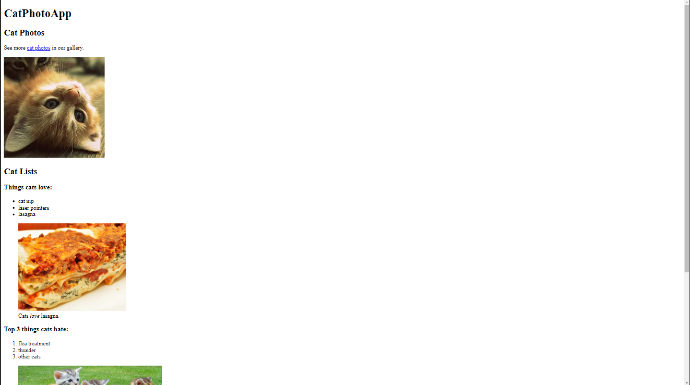
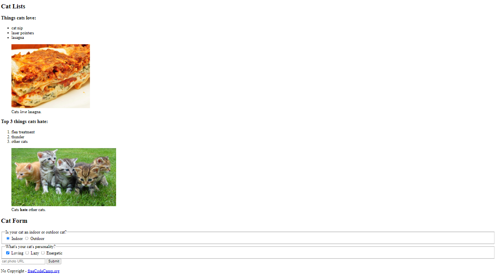
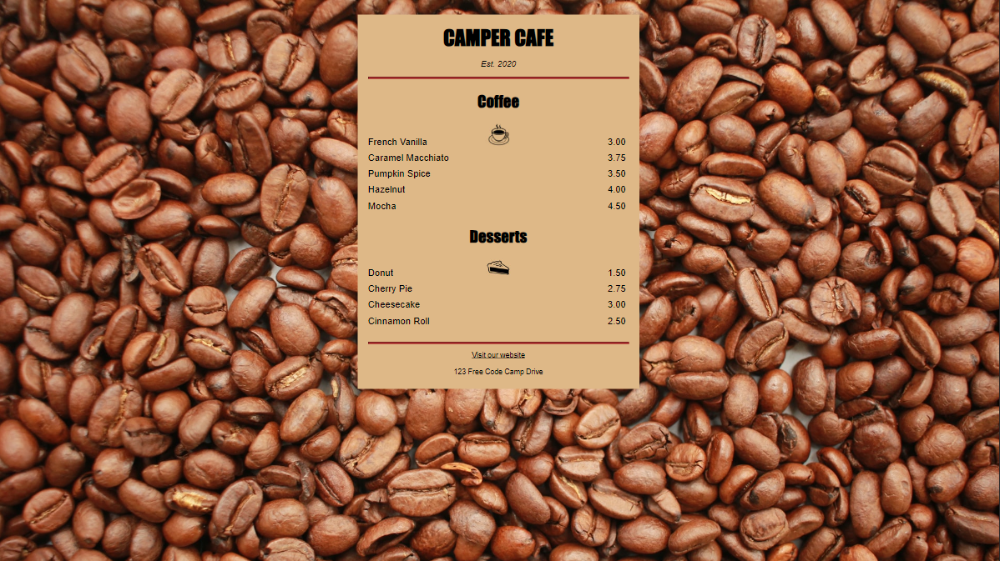

# [Responsive-Web-Design](https://www.freecodecamp.org/learn/2022/responsive-web-design/)

This repository has the entire source code for this freeCodeCamp course.

## Projects

### 1. Learn HTML by building a CAT Photo App

<table>
    <tr><td></td>&nbsp;&nbsp;<td></td></tr>
</table>

### 2. Learn Basic CSS Building a Cafe Menu

<table>
    <tr><td></td></tr>
</table>

## License & copyright

© Manu Mathew

Licensed under the [MIT License](LICENSE)